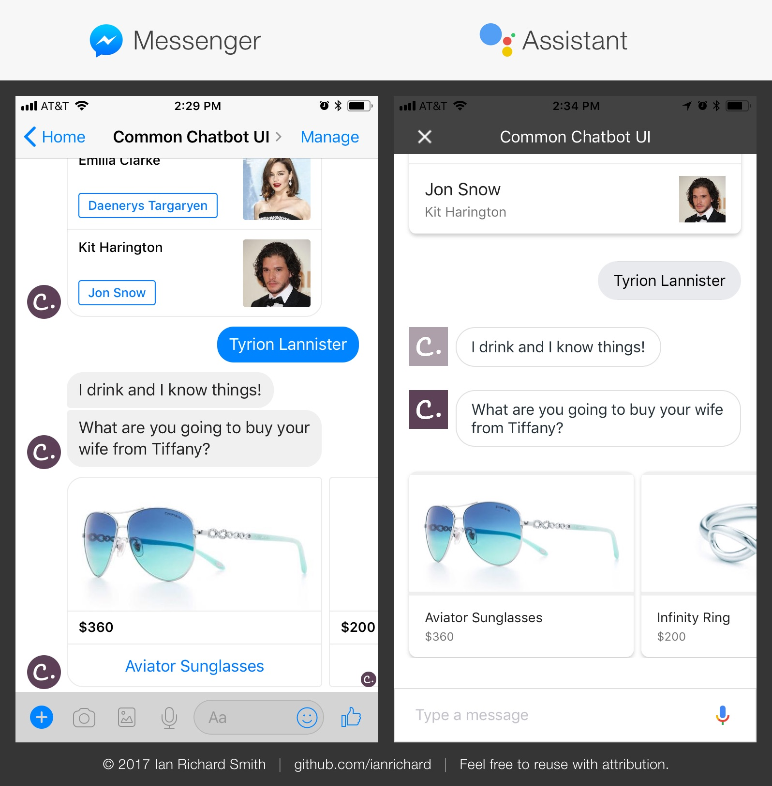

# What is this?

This will allow you to connect your own webhooks to Dialogflow (formerly API.AI) for dynamic distributed chat applications.

This is a work in progress and potentially unstable.  There is currently an unresolved issue on Google Assistant with handling consecutive list / carousel items.

# UI Components

You can create your own custom-formatted response for each platform, but this template project uses the underlying [common-chatbot-ui](https://github.com/ianrichard/common-chatbot-ui) module. Visual examples of each available component are shown on that repo's readme.

# Setup

## Run Your Local Service

- Open your terminal
- `git clone git@github.com:ianrichard/common-chatbot-ui-starter-project.git`
- `cd common-chatbot-ui-starter-project`
- (Optional) If you're going to use Facebook Messenger and want to access user profile data, make a facebook-access-token.txt in the root of the project next to package.json.  Paste the page access token as a single line in that file.  This is not checked in for security purposes and so people don't accidentally copy your project.
- `npm install`
- `npm run dev`
- A URL will be listed once that runs that you can hit in the browser such as `https://abcde12345.localtunnel.me`

## Configuring Dialogflow

### Set up the Project
- Be sure to follow all of the setup instructions from the [Dialogflow console](http://console.Dialogflow) for getting the project started and the integrations hooked up for Assistant and Messenger

### Configure the Webhook
- Select "Fulfillment" tab on the left side of the screen
- On the URL, put the URL of your service (note that with local tunnelling, it will probably pretty temporary, so you'll have to update periodically)
- Domains > Enable webhook for all domains

### Dialogflow Setup

- In your Dialogflow project, go to the project settings (gear icon) > Export and Import, then "Import from ZIP".  From this project, upload `dialogflow-project/common-chatbot-ui-export.zip`
- If you want to hook this up on your own (or want to add new intents), continue the following steps.
- On any intent, including the default welcome one, be sure an action name is assigned.
- Under "Fulfillment", check "Use webhook"
- Note, you need to repeat this same thing for every new intent you make.
- If you use webhooks, then do not try and enter inputs manually in Dialogflow unless you want a text fallback message for the webhook service failure.
- The action names will correspond to the keys of the return object in responses/index.js.  The initial welcome and errors are a bit of an exception and you can see how that's being dealt with in utils/request-handler.js.
- Also look at logs/original-incoming-dialogflow-data.json to see what is being processed.

# Contributing to Underlying common-chatbot-ui Framework

- Clone [common-chatbot-ui](https://github.com/ianrichard/common-chatbot-ui) as a sibling project to this one (i.e. common-chatbot-ui and common-chatbot-ui-starter-project are right next to each other on your local file system)
- `cd common-chatbot-ui`, `npm install`, `npm link`
- `cd ../common-chatbot-ui-starter-project`, `npm link common-chatbot-ui`
- When you run `npm run dev` in this project, Babel has a watcher into the underlying repo and transpiles it vs you having to do it on the underlying repo
- Once you've done awesome stuff, do a pull request in [common-chatbot-ui](https://github.com/ianrichard/common-chatbot-ui)

# Alternative Hosting Solutions

## Cloud 9

This is best if you don't have a local workspace configured.  Maybe you're on a corporate machine that can't install all of the software, you're new to development and don't want to bother with workspace setup, like the cloud aspect of C9 that can easily be loaded on any machine, etc.  The main downside is you can't edit files on the local machine and have to use their browser-based IDE.

You don't need to do this if you have the local workspace running as listed above.

- Open your project in [Cloud 9](https://c9.io). Sign up for a free account if you haven't yet done so.
- Follow all of the instructions from the "Run Your Local Service" section

## Google Cloud Platform

Local tunnelling and Cloud 9 are meant to be development tools, not production.  At some point, you'll need to deploy your code to a production server such as Google Cloud, Amazon Web Service (AWS), Digital Ocean, etc.

For the sake of this project, we'll use the Google Cloud Platform, but the concept is more or less the same for deploying it anywhere.

- If you're just getting started, be sure to follow the docs listed on the [Google App Engine Node.js Flexible Environment Documentation](https://cloud.google.com/appengine/docs/flexible/nodejs/).
- Once you have that set up, in your project be sure to do the build step above.
- Type `gcloud app deploy`
- It can take 10 mins or so, but once it's done, you can load it by the URL it lists.
- You can get back to that URL later on by typing `gcloud app services browse default`
- Make sure you put this URL in the fulfillment section
  - I suggest having a "WIP" app that's unstable and pointing to local services, then a "prod" app that's stable and uses your deployed services
