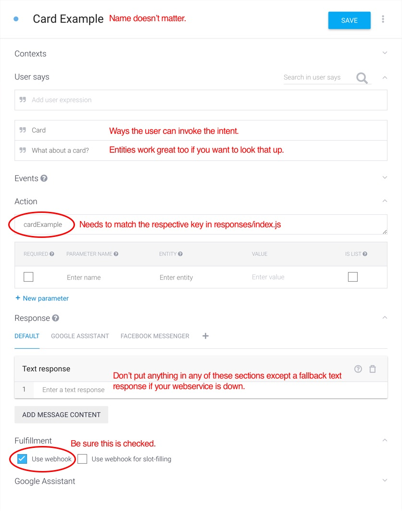

# What is this?

This will allow you to create webhooks for integrating with Facebook Messenger directly or through the intermediary intent-processing platform Dialogflow (formerly API.ai), which can subsequently connect to Facebook Messenger, Google Assistant and many other platforms.

This template project uses the underlying [common-chatbot](https://github.com/ianrichard/common-chatbot) module, which simplifies and abstracts responses for the platforms so you can focus more on your app vs the implementation.

# UI Component Examples

More visual examples of each available component are shown on the [common-chatbot](https://github.com/ianrichard/common-chatbot) readme.

# Setup

## Response Option Configuration

- Open `src\responses\index.js` and change all reference of `https://yourrepo.github.io` to wherever your repo is.
- Also be sure that you [configure Github Pages](https://pages.github.com/) for your cloned or forked repo.  For simple projects, you can use master, but if you have a dev version, you can set it to another branch.

## Run Your Local Service

- Open your terminal
- `git clone git@github.com:ianrichard/common-chatbot-starter-project.git`
- `cd common-chatbot-starter-project`
- `npm install`
- Open `package.json` and on the `dev` setting under `scripts`, change `yoursubdomain` to whatever you want.  This is useful for keeping a persistent URL that you can set in Dialogflow instead of getting the default randomly-assigned one from localtunnel.me.
  - If you don't change `yoursubdomain`, you'll likely be in conflict with other people who aren't paying attention to this message and get random stuff.
  - Some people use ngrok instead of localtunnel, but if you set the subdomain flag on localtunnel, it's essentially the same thing for free :)
- `npm run dev`
- A URL will be listed once that runs that you can hit in the browser such as `https://yoursubdomain.localtunnel.me`

# Configuring Facebook Messenger Webhook

- In the "Webhooks" tab of the app's settings in the [Facebook developer console](https://developers.facebook.com), set the subscription to the URL of your service that was set up earlier.

# Configuring Dialogflow Webhook

## Set up the Project
- Be sure to follow all of the setup instructions from the [Dialogflow console](http://console.Dialogflow) for getting the project started and the integrations hooked up for Assistant and Messenger

## Configure the Webhook
- Select "Fulfillment" tab on the left side of the screen
- On the URL, put the URL of your service that was set up earlier.
- Domains > Enable webhook for all domains

## Project Setup
- In your Dialogflow project, go to the project settings (gear icon) > Export and Import, then "Import from ZIP".  From this project, upload `dialogflow-project/common-chatbot-export.zip`
- If you want to hook this up on your own (or want to add new intents), continue the following steps.
- On any intent, including the default welcome one, be sure an action name is assigned.
- Under "Fulfillment", check "Use webhook"
- Note, you need to repeat this same thing for every new intent you make.
- If you use webhooks, then do not try and enter inputs manually in Dialogflow unless you want a text fallback message for the webhook service failure.
- The action names will correspond to the keys of the return object in responses/index.js.  The initial welcome and errors are a bit of an exception and you can see how that's being dealt with in utils/request-handler.js.
- Also look at logs/original-incoming-dialogflow-data.json to see what is being processed.

# Webview Configuration

- If you want to explicitly close or send messages from your webview, or access user profile data, you'll need to enter the accessToken and pageId in the package.json file.  Be sure to not check this in for security purposes.
  - If you don't need this, don't enter those values in `package.json` and delete the majority of the Facebook section in `webview.js`.

# Contributing to Underlying common-chatbot Framework

- Clone [common-chatbot](https://github.com/ianrichard/common-chatbot) as a sibling project to this one (i.e. common-chatbot and common-chatbot-starter-project are right next to each other on your local file system)
- `cd common-chatbot`, `npm install`
- When you run `npm run dev` in this project, Babel has a watcher into the underlying repo and transpiles it vs you having to run anything on the other repo.  You don't need to do NPM linking.  This project has a watcher for a sibling project and if it does, it transpiles the code and copies it into the node_modules for you.
- Once you've done awesome stuff, do a pull request in [common-chatbot](https://github.com/ianrichard/common-chatbot)

# Alternative Hosting Solutions

## Cloud 9

This is best if you don't have a local workspace configured.  Maybe you're on a corporate machine that can't install all of the software, you're new to development and don't want to bother with workspace setup, like the cloud aspect of C9 that can easily be loaded on any machine, etc.  The main downside is you can't edit files on the local machine and have to use their browser-based IDE.

You don't need to do this if you have the local workspace running as listed above.

- Open your project in [Cloud 9](https://c9.io). Sign up for a free account if you haven't yet done so.
- Follow all of the instructions from the "Run Your Local Service" section

## Google Cloud Platform

Local tunnelling and Cloud 9 are meant to be development tools, not production.  At some point, you'll need to deploy your code to a production server such as Google Cloud, Amazon Web Service (AWS), Digital Ocean, etc.

For the sake of this project, we'll use the Google Cloud Platform, but the concept is more or less the same for deploying it anywhere.

- If you're just getting started, be sure to follow the docs listed on the [Google App Engine Node.js Flexible Environment Documentation](https://cloud.google.com/appengine/docs/flexible/nodejs/).
- Once you have that set up, in your project be sure to do the build step above.
- Type `gcloud app deploy`
- It can take 10 mins or so, but once it's done, you can load it by the URL it lists.
- You can get back to that URL later on by typing `gcloud app services browse default`
- Make sure you put this URL in the fulfillment section
  - I suggest having a "WIP" app that's unstable and pointing to local services, then a "prod" app that's stable and uses your deployed services
